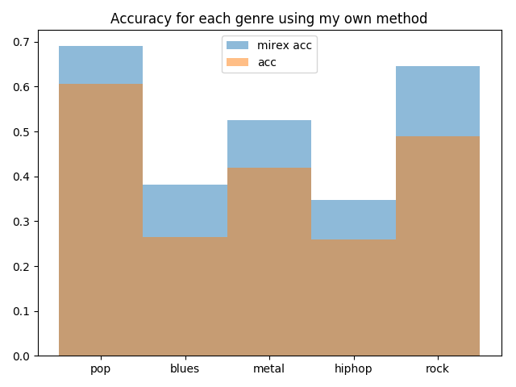

# Homework 1 for Music Information Retrieval

## Environment

* ubuntu 16.04 LTS
* python3.5.2 (using Pycharm 2018.1)
* extra modules: numpy, scipy, matplotlib, prettytable, librosa, keras

## Prior Preparation

Before using the codes, please download [GTZAN](http://marsyas.info/downloads/datasets.html) dataset 
and it's [key notation](https://github.com/alexanderlerch/gtzan_key); then go to [utils.py](utils.py), 
change _audio_dir_ and _label_dir_ to the location where you download the data. 
```
audio_dir = '/your/dataset/path'
label_dir = '/your/dataset/anotation/path'
```

## Usage of each file

### Q1~3: Binary template matching for global key detection

In this task, we use binary major/minor key template to compare the similarity with summed chroma feature.
Only test on five genre.
```
bin_major_template = np.array([[1, 0, 1, 0, 1, 1, 0, 1, 0, 1, 0, 1]]) / np.sqrt(7.0)
bin_minor_template = np.array([[1, 0, 1, 1, 0, 1, 0, 1, 1, 0, 1, 0]]) / np.sqrt(7.0)
```

The program will output prediction of each song, genre raw accuracy and MIREX accuracy.

```
+--------+------+---------------+----------------------+----------------------+----------+----------------+
| Genre  | Same | Perfect Fifth | Relative Minor/Major | Parallel Minor/Major | Accuracy | MIREX Accuracy |
+--------+------+---------------+----------------------+----------------------+----------+----------------+
|  pop   |  37  |       21      |          7           |          9           | 0.393617 |    0.546809    |
| blues  |  7   |       10      |          3           |          46          | 0.071429 |    0.225510    |
| metal  |  24  |       17      |          3           |          21          | 0.258065 |    0.404301    |
| hiphop |  10  |       4       |          5           |          11          | 0.123457 |    0.193827    |
|  rock  |  39  |       22      |          8           |          8           | 0.397959 |    0.551020    |
|  All   | 117  |       74      |          26          |          95          | 0.252155 |    0.389655    |
+--------+------+---------------+----------------------+----------------------+----------+----------------+
```


You can try to change the value _g_ in [Q1_3.py](Q1-3.py), which is the factor of logarithmic compression, 
to see how it effect the result.

### Q4: Krumhansl-Schmuckler key-finding algorithm

The task is quite the same as the previous one, but we change binary template to Krumhansl-Schmuckler profile, 
which highly enhance the detection result.
```
ks_major_template = np.array([[6.35, 2.23, 3.48, 2.33, 4.38, 4.09, 2.52, 5.19, 2.39, 3.66, 2.29, 2.88]])
ks_minor_template = np.array([[6.33, 2.68, 3.52, 5.38, 2.6, 3.53, 2.54, 4.75, 3.98, 2.69, 3.34, 3.17]])

+--------+------+---------------+----------------------+----------------------+----------+----------------+
| Genre  | Same | Perfect Fifth | Relative Minor/Major | Parallel Minor/Major | Accuracy | MIREX Accuracy |
+--------+------+---------------+----------------------+----------------------+----------+----------------+
|  pop   |  59  |       12      |          4           |          6           | 0.627660 |    0.717021    |
| blues  |  15  |       1       |          1           |          50          | 0.153061 |    0.263265    |
| metal  |  38  |       9       |          2           |          20          | 0.408602 |    0.506452    |
| hiphop |  20  |       10      |          4           |          9           | 0.246914 |    0.345679    |
|  rock  |  48  |       23      |          6           |          8           | 0.489796 |    0.641837    |
|  All   | 180  |       55      |          17          |          93          | 0.387931 |    0.498276    |
+--------+------+---------------+----------------------+----------------------+----------+----------------+
```


### Q5: Blues+ key-finding

This task actually ask the student to design a new algorithm to perform key finding, 
and I found that blues genre has the lowest score among the above method. 
So I decided to add two extra blues major/minor template to the KS-profile method, 
and the result outperform the previous method overall.
```
blues_major_template = np.array([[1, 0, 1, 1, 1, 0, 0, 1, 0, 1, 0, 0]]) / np.sqrt(6)
blues_minor_template = np.array([[1, 0, 0, 1, 0, 1, 1, 1, 0, 0, 1, 0]]) / np.sqrt(6)

+--------+------+---------------+----------------------+----------------------+----------+----------------+
| Genre  | Same | Perfect Fifth | Relative Minor/Major | Parallel Minor/Major | Accuracy | MIREX Accuracy |
+--------+------+---------------+----------------------+----------------------+----------+----------------+
|  pop   |  57  |       11      |          5           |          5           | 0.606383 |    0.691489    |
| blues  |  26  |       5       |          1           |          43          | 0.265306 |    0.381633    |
| metal  |  39  |       10      |          4           |          18          | 0.419355 |    0.524731    |
| hiphop |  21  |       10      |          5           |          3           | 0.259259 |    0.346914    |
|  rock  |  48  |       20      |          10          |          11          | 0.489796 |    0.644898    |
|  All   | 191  |       56      |          25          |          80          | 0.411638 |    0.522629    |
+--------+------+---------------+----------------------+----------------------+----------+----------------+
```


### Q6: Local key detection

Different from the above tast, we need to find the key at each time steps in the songs.
I use KS-profile matching Q4 and lots of average filtering(window size ~= 64s) on the chroma feature, 
eventually reach almost 60% of MIREX accuracy.

The data used here is Beethoven’s Piano Sonata Functional Harmony made by the course teacher, 
unfortunately I can't give it to others.
```
song    accuracy    mirex accuracy
1.wav 0.517500 0.642500
3.wav 0.358993 0.578058
5.wav 0.427677 0.490403
6.wav 0.298267 0.494183
8.wav 0.608796 0.661632
11.wav 0.657303 0.723876
12.wav 0.301370 0.548493
13.wav 0.364103 0.482051
14.wav 0.666667 0.731522
16.wav 0.269495 0.428211
18.wav 0.757812 0.798437
19.wav 0.665517 0.739655
20.wav 0.216867 0.328112
21.wav 0.481338 0.555470
22.wav 0.623423 0.697838
23.wav 0.358298 0.432295
24.wav 0.571078 0.629534
25.wav 0.431900 0.612455
26.wav 0.504167 0.683417
27.wav 0.676190 0.740544
28.wav 0.558824 0.653595
31.wav 0.658046 0.696264
32.wav 0.626794 0.719019
overall 0.488095 0.594645
```

I also have tried to use CNN to solve the task, you can check out [here](ML_key_detect.ipynb).

## Reference

